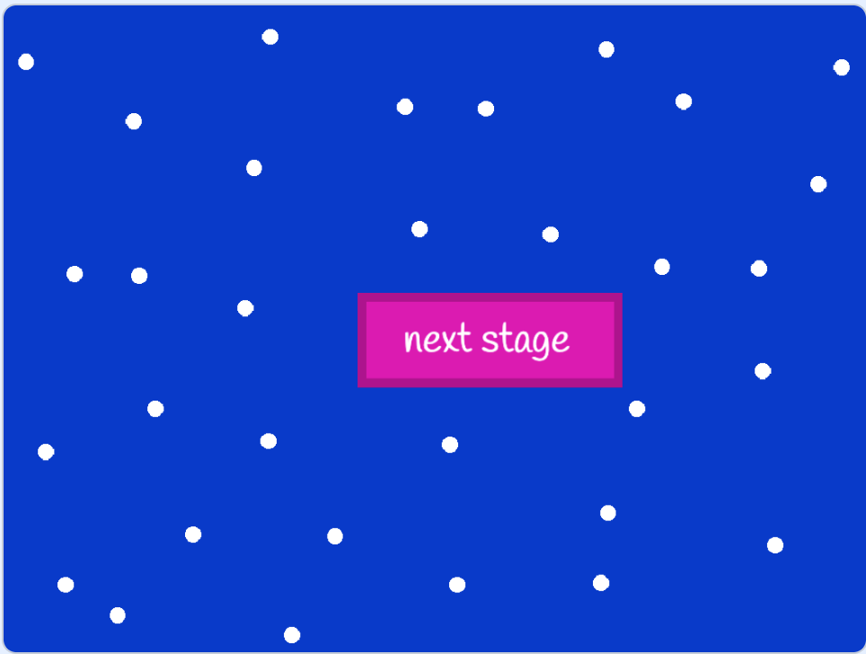

# Game Objectives

To play the game we use `➡️`, `⬅️`, `⬆️`, `⬇️` arrows. When the boy 👦 touches the banana 🍌 then
there will be a message `YOU ARE A WINNER`.

Objects you need to create in this game:

1. You need to draw `backdrop` -> maze
2. You need to draw `a boy` sprite -> hero of the game (banana seeker boy)
3. You need to import `banana` sprite
4. You need to draw `YOU ARE A WINNER` sprite

These are the steps to basic game and from there, we will make it advanced.

# Step by Step explanation

So far we have been using `when🏴clicked` then start the game but this time we don't have to use that to start.

1. Step is to draw a maze: to do that you need to go to `backdrop` and choose `paint` from there you will draw it.

How to draw maze is up to you `USE YOUR IMAGINATION!` or ofcourse you can follow my design.

2. Step is to draw a boy: for this one you can `create/import/draw` you own `seeker` some students import `🏀` sprite,
   some of them draw `robot 🤖`, it is up to your imagination.

3. Step is to `draw/import` banana: this one also up to you, you can draw `gold or banana` or import from `sprite library`.

4. Step is to write `YOU ARE A WINNER` message (you know how to do this one. 😄).

# Pay attention!!!!

1. When the `👦` boy touches any of the maze line, he should be returned the position he started (start line).
   `if touches color then go to x number y number`

2. When the `👦` touches the `🍌` message `YOU ARE A WINNER` should be appeared.
   For that create new `variable`. I call this `score`. Then `when 🏴clicked` `set score to 0`. In `👦` code `if touches 🍌? then`
   `change score by 1`. In `YOU ARE A WINNER` sprite check the `score` `if score > 0 then show message`.

<iframe
  src="https://scratch.mit.edu/projects/397209822/embed"
  allowtransparency="true"
  width="600"
  height="402"
  frameborder="0"
  scrolling="no"
  allowfullscreen
></iframe>

Did you finish? congrats buddy 🎊! NOW CHALLANGE TIME!!!

# Challange

Let's upgrade the game !!!

1. When the `👦` touches the `🍌`, the `YOU ARE A WINNER` message should appear for `4 second`
   `wait 4 seconds`. Then message should be `hide` again and the `👦` should go to next stage.

2. You need to create new sprite just like the image below:
   
   
